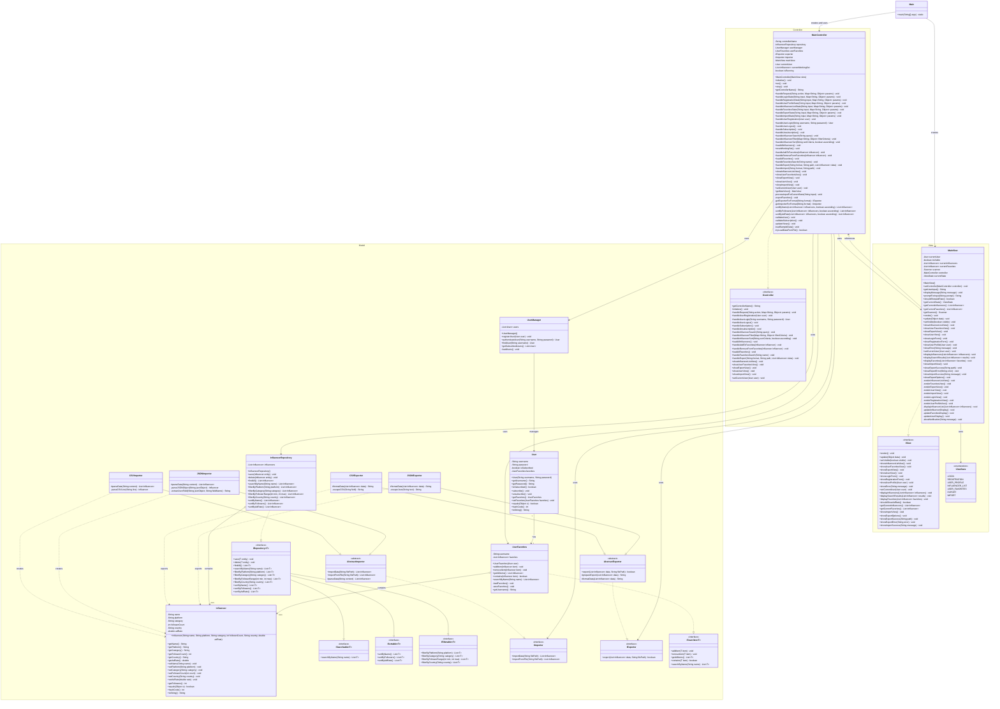

```mermaid
classDiagram
    %% Model Layer
    namespace Model {
        class Influencer {
            -String name
            -String platform
            -String category
            -int followerCount
            -String country
            -double adRate
            +Influencer(String name, String platform, String category, int followerCount, String country, double adRate)
            +getName() String
            +getPlatform() String
            +getCategory() String
            +getFollowerCount() int
            +getCountry() String
            +getAdRate() double
            +setName(String name) void
            +setPlatform(String platform) void
            +setCategory(String category) void
            +setFollowerCount(int count) void
            +setCountry(String country) void
            +setAdRate(double rate) void
            +getFollowers() int
            +equals(Object o) boolean
            +hashCode() int
            +toString() String
        }

        class User {
            -String username
            -String password
            -boolean isSubscribed
            -UserFavorites favorites
            +User(String username, String password)
            +getUsername() String
            +getPassword() String
            +isSubscribed() boolean
            +subscribe() void
            +unsubscribe() void
            +getFavorites() UserFavorites
            +setFavorites(UserFavorites favorites) void
            +equals(Object o) boolean
            +hashCode() int
            +toString() String
        }

        %% Interfaces
        class ISearchable~T~ {
            <<interface>>
            +searchByName(String name) List~T~
        }

        class ISortable~T~ {
            <<interface>>
            +sortByName() List~T~
            +sortByFollowers() List~T~
            +sortByAdRate() List~T~
        }

        class IFilterable~T~ {
            <<interface>>
            +filterByPlatform(String platform) List~T~
            +filterByCategory(String category) List~T~
            +filterByFollowerRange(int min, int max) List~T~
            +filterByCountry(String country) List~T~
        }

        class IRepository~T~ {
            <<interface>>
            +save(T entity) void
            +delete(T entity) void
            +findAll() List~T~
            +searchByName(String name) List~T~
            +filterByPlatform(String platform) List~T~
            +filterByCategory(String category) List~T~
            +filterByFollowerRange(int min, int max) List~T~
            +filterByCountry(String country) List~T~
            +sortByName() List~T~
            +sortByFollowers() List~T~
            +sortByAdRate() List~T~
        }

        class IImporter {
            <<interface>>
            +importData(String filePath) List~Influencer~
            +importFromFile(String filePath) List~Influencer~
        }

        class IExporter {
            <<interface>>
            +export(List~Influencer~ data, String filePath) boolean
        }

        class IFavorites~T~ {
            <<interface>>
            +addItem(T item) void
            +removeItem(T item) void
            +getAllItems() List~T~
            +contains(T item) boolean
            +searchByName(String name) List~T~
        }

        %% Abstract Classes
        class AbstractImporter {
            <<abstract>>
            +importData(String filePath) List~Influencer~
            +importFromFile(String filePath) List~Influencer~
            #parseData(String content) List~Influencer~
        }

        class AbstractExporter {
            <<abstract>>
            +export(List~Influencer~ data, String filePath) boolean
            #prepareExport(List~Influencer~ data) String
            #formatData(List~Influencer~ data) String
        }

        %% Concrete Classes
        class InfluencerRepository {
            -List~Influencer~ influencers
            +InfluencerRepository()
            +save(Influencer entity) void
            +delete(Influencer entity) void
            +findAll() List~Influencer~
            +searchByName(String name) List~Influencer~
            +filterByPlatform(String platform) List~Influencer~
            +filterByCategory(String category) List~Influencer~
            +filterByFollowerRange(int min, int max) List~Influencer~
            +filterByCountry(String country) List~Influencer~
            +sortByName() List~Influencer~
            +sortByFollowers() List~Influencer~
            +sortByAdRate() List~Influencer~
        }

        class UserFavorites {
            -String username
            -List~Influencer~ favorites
            +UserFavorites(User user)
            +addItem(Influencer item) void
            +removeItem(Influencer item) void
            +getAllItems() List~Influencer~
            +contains(Influencer item) boolean
            +searchByName(String name) List~Influencer~
            -loadFavorites() void
            -saveFavorites() void
            +getUsername() String
        }

        class UserManager {
            -List~User~ users
            +UserManager()
            +registerUser(User user) void
            +authenticateUser(String username, String password) User
            +findUser(String username) User
            +getSubscribedUsers() List~User~
            -loadUsers() void
        }

        class CSVImporter {
            #parseData(String content) List~Influencer~
            -parseCSVLine(String line) Influencer
        }

        class JSONImporter {
            #parseData(String content) List~Influencer~
            -parseJSONObject(String jsonObject) Influencer
            -extractJsonField(String jsonObject, String fieldName) String
        }

        class CSVExporter {
            #formatData(List~Influencer~ data) String
            -escapeCSV(String field) String
        }

        class JSONExporter {
            #formatData(List~Influencer~ data) String
            -escapeJson(String text) String
        }
    }

    %% Controller Layer
    namespace Controller {
        class IController {
            <<interface>>
            +getControllerName() String
            +initialize() void
            +handleRequest(String action, Map~String, Object~ params) void
            +handleUserRegistration(User user) void
            +handleUserLogin(String username, String password) User
            +handleUserLogout() void
            +handleSubscription() void
            +handleUnsubscription() void
            +handleInfluencerSearch(String query) void
            +handleInfluencerFilter(Map~String, Object~ filterCriteria) void
            +handleInfluencerSort(String sortCriteria, boolean ascending) void
            +loadAllInfluencers() void
            +handleAddToFavorites(Influencer influencer) void
            +handleRemoveFromFavorites(Influencer influencer) void
            +loadAllFavorites() void
            +handleFavoritesSearch(String name) void
            +handleExport(String format, String path, List~Influencer~ data) void
            +showInfluencerListView() void
            +showUserFavoritesView() void
            +showExportView() void
            +showUserView() void
            +showImportView() void
            +setCurrentUser(User user) void
        }

        class MainController {
            -String controllerName
            -InfluencerRepository repository
            -UserManager userManager
            -UserFavorites userFavorites
            -IExporter exporter
            -IImporter importer
            -MainView mainView
            -User currentUser
            -List~Influencer~ currentWorkingSet
            -boolean isRunning
            +MainController(MainView view)
            +initialize() void
            +run() void
            +stop() void
            +getControllerName() String
            +handleRequest(String action, Map~String, Object~ params) void
            +handleLoginState(String input, Map~String, Object~ params) void
            +handleRegistrationState(String input, Map~String, Object~ params) void
            +handleUserProfileState(String input, Map~String, Object~ params) void
            +handleInfluencerListState(String input, Map~String, Object~ params) void
            +handleFavoritesState(String input, Map~String, Object~ params) void
            +handleExportState(String input, Map~String, Object~ params) void
            +handleImportState(String input, Map~String, Object~ params) void
            +handleUserRegistration(User user) void
            +handleUserLogin(String username, String password) User
            +handleUserLogout() void
            +handleSubscription() void
            +handleUnsubscription() void
            +handleInfluencerSearch(String query) void
            +handleInfluencerFilter(Map~String, Object~ filterCriteria) void
            +handleInfluencerSort(String sortCriteria, boolean ascending) void
            +loadAllInfluencers() void
            +resetWorkingSet() void
            +handleAddToFavorites(Influencer influencer) void
            +handleRemoveFromFavorites(Influencer influencer) void
            +loadAllFavorites() void
            +handleFavoritesSearch(String name) void
            +handleExport(String format, String path, List~Influencer~ data) void
            +handleImport(String format, String path) void
            +showInfluencerListView() void
            +showUserFavoritesView() void
            +showExportView() void
            +showUserView() void
            +showImportView() void
            +setCurrentUser(User user) void
            +getMainView() MainView
            -processInputForCurrentState(String input) void
            -exportFavorites() void
            -getExporterForFormat(String format) IExporter
            -getImporterForFormat(String format) IImporter
            -sortByName(List~Influencer~ influencers, boolean ascending) List~Influencer~
            -sortByFollowers(List~Influencer~ influencers, boolean ascending) List~Influencer~
            -sortByAdRate(List~Influencer~ influencers, boolean ascending) List~Influencer~
            -validateUser() void
            -validateSubscription() void
            -updateViews() void
            -loadSampleData() void
            -tryLoadDataFromFile() boolean
        }
    }

    %% View Layer
    namespace View {
        class IView {
            <<interface>>
            +render() void
            +update(Object data) void
            +setVisible(boolean visible) void
            +showInfluencerListView() void
            +showUserFavoritesView() void
            +showExportView() void
            +showUserView() void
            +showLoginForm() void
            +showRegistrationForm() void
            +showUserProfile(User user) void
            +showError(String message) void
            +setCurrentUser(User user) void
            +displayInfluencers(List~Influencer~ influencers) void
            +displaySearchResults(List~Influencer~ results) void
            +displayFavorites(List~Influencer~ favorites) void
            +shouldShowAdRate() boolean
            +getCurrentInfluencers() List~Influencer~
            +getCurrentFavorites() List~Influencer~
            +showImportView() void
            +showExportOptions() void
            +showExportSuccess(String path) void
            +showExportError(String error) void
            +showImportSuccess(String message) void
        }

        class MainView {
            -User currentUser
            -boolean isVisible
            -List~Influencer~ currentInfluencers
            -List~Influencer~ currentFavorites
            -Scanner scanner
            -MainController controller
            -ViewState currentState
            +MainView()
            +setController(MainController controller) void
            +getUserInput() String
            +displayMessage(String message) void
            +promptForInput(String prompt) String
            +shouldShowAdRate() boolean
            +getCurrentState() ViewState
            +getCurrentInfluencers() List~Influencer~
            +getCurrentFavorites() List~Influencer~
            +getScanner() Scanner
            +render() void
            +update(Object data) void
            +setVisible(boolean visible) void
            +showInfluencerListView() void
            +showUserFavoritesView() void
            +showExportView() void
            +showUserView() void
            +showLoginForm() void
            +showRegistrationForm() void
            +showUserProfile(User user) void
            +showError(String message) void
            +setCurrentUser(User user) void
            +displayInfluencers(List~Influencer~ influencers) void
            +displaySearchResults(List~Influencer~ results) void
            +displayFavorites(List~Influencer~ favorites) void
            +showImportView() void
            +showExportSuccess(String path) void
            +showExportError(String error) void
            +showImportSuccess(String message) void
            +showExportOptions() void
            -renderInfluencerListView() void
            -renderFavoritesView() void
            -renderExportView() void
            -renderUserView() void
            -renderImportView() void
            -renderLoginView() void
            -renderRegistrationView() void
            -renderUserProfileView() void
            -displayInfluencerList(List~Influencer~ influencers) void
            -updateInfluencerDisplay() void
            -updateFavoritesDisplay() void
            -updateUserDisplay() void
            -showNotification(String message) void
        }

        class ViewState {
            <<enumeration>>
            LOGIN
            REGISTRATION
            USER_PROFILE
            INFLUENCER_LIST
            USER_FAVORITES
            EXPORT
            IMPORT
        }
    }

    %% Main class
    class Main {
        +main(String[] args) static
    }

    %% Relationships
    %% Interface inheritance relationships
    IRepository --|> ISearchable
    IRepository --|> ISortable
    IRepository --|> IFilterable

    InfluencerRepository ..|> IRepository
    UserFavorites ..|> IFavorites

    AbstractImporter ..|> IImporter
    CSVImporter --|> AbstractImporter
    JSONImporter --|> AbstractImporter

    AbstractExporter ..|> IExporter
    CSVExporter --|> AbstractExporter
    JSONExporter --|> AbstractExporter

    MainController ..|> IController
    MainView ..|> IView

    MainController --> MainView : uses
    MainController --> InfluencerRepository : uses
    MainController --> UserManager : uses
    MainController --> UserFavorites : uses
    MainController --> IExporter : uses
    MainController --> IImporter : uses

    MainView --> MainController : references
    MainView --> ViewState : uses

    User "1" --> "1" UserFavorites : has
    UserManager --> User : manages

    Main --> MainController : creates and uses
    Main --> MainView : creates

    CSVImporter ..> Influencer : creates
    JSONImporter ..> Influencer : creates
    CSVExporter ..> Influencer : exports
    JSONExporter ..> Influencer : exports
    InfluencerRepository o--> "many" Influencer : contains
    UserFavorites o--> "many" Influencer : contains 

```