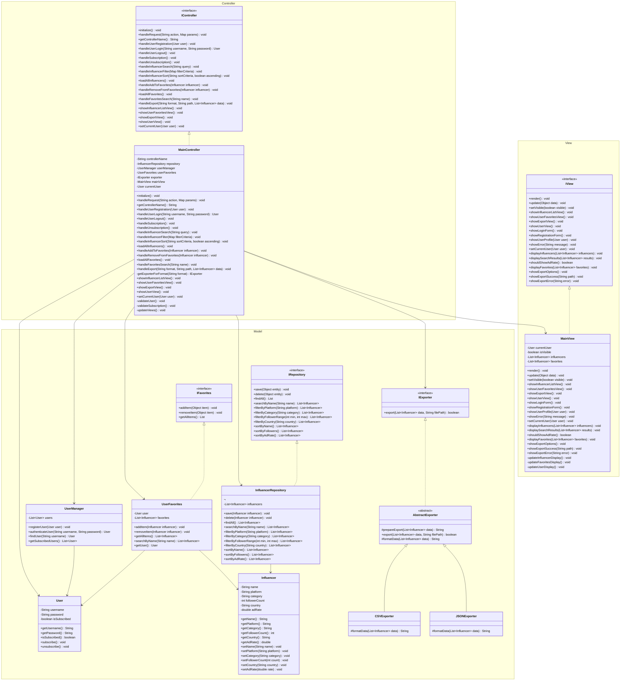

```mermaid
classDiagram
    %% MODEL LAYER
    namespace Model {
        class IRepository {
            <<interface>>
            +save(Object entity) void
            +delete(Object entity) void
            +findAll() List
            +searchByName(String name) List~Influencer~
            +filterByPlatform(String platform) List~Influencer~
            +filterByCategory(String category) List~Influencer~
            +filterByFollowerRange(int min, int max) List~Influencer~
            +filterByCountry(String country) List~Influencer~
            +sortByName() List~Influencer~
            +sortByFollowers() List~Influencer~
            +sortByAdRate() List~Influencer~
        }
        
        class InfluencerRepository {¬
            -List~Influencer~ influencers
            +save(Influencer influencer) void
            +delete(Influencer influencer) void
            +findAll() List~Influencer~
            +searchByName(String name) List~Influencer~
            +filterByPlatform(String platform) List~Influencer~
            +filterByCategory(String category) List~Influencer~
            +filterByFollowerRange(int min, int max) List~Influencer~
            +filterByCountry(String country) List~Influencer~
            +sortByName() List~Influencer~
            +sortByFollowers() List~Influencer~
            +sortByAdRate() List~Influencer~
        }
        
        class User {
            -String username
            -String password
            -boolean isSubscribed
            +getUsername() String
            +getPassword() String
            +isSubscribed() boolean
            +subscribe() void
            +unsubscribe() void
        }
        
        class Influencer {
            -String name
            -String platform
            -String category
            -int followerCount
            -String country
            -double adRate
            +getName() String
            +getPlatform() String
            +getCategory() String
            +getFollowerCount() int
            +getCountry() String
            +getAdRate() double
            +setName(String name) void
            +setPlatform(String platform) void
            +setCategory(String category) void
            +setFollowerCount(int count) void
            +setCountry(String country) void
            +setAdRate(double rate) void
        }
        
        class IFavorites {
            <<interface>>
            +addItem(Object item) void
            +removeItem(Object item) void
            +getAllItems() List
        }
        
        class UserFavorites {
            -User user
            -List~Influencer~ favorites
            +addItem(Influencer influencer) void
            +removeItem(Influencer influencer) void
            +getAllItems() List~Influencer~
            +searchByName(String name) List~Influencer~
            +getUser() User
        }
        
        class UserManager {
            -List~User~ users
            +registerUser(User user) void
            +authenticateUser(String username, String password) User
            +findUser(String username) User
            +getSubscribedUsers() List~User~
        }
        
        class IExporter {
            <<interface>>
            +export(List~Influencer~ data, String filePath) boolean
        }
        
        class AbstractExporter {
            <<abstract>>
            #prepareExport(List~Influencer~ data) String
            +export(List~Influencer~ data, String filePath) boolean
            #formatData(List~Influencer~ data) String
        }
        
        class CSVExporter {
            #formatData(List~Influencer~ data) String
        }
        
        class JSONExporter {
            #formatData(List~Influencer~ data) String
        }
    }
    
    %% VIEW LAYER
    namespace View {
        class IView {
            <<interface>>
            +render() void
            +update(Object data) void
            +setVisible(boolean visible) void
            
            +showInfluencerListView() void
            +showUserFavoritesView() void
            +showExportView() void
            +showUserView() void
            
            +showLoginForm() void
            +showRegistrationForm() void
            +showUserProfile(User user) void
            +showError(String message) void
            +setCurrentUser(User user) void
            
            +displayInfluencers(List~Influencer~ influencers) void
            +displaySearchResults(List~Influencer~ results) void
            +shouldShowAdRate() boolean
            
            +displayFavorites(List~Influencer~ favorites) void
            
            +showExportOptions() void
            +showExportSuccess(String path) void
            +showExportError(String error) void
        }
        
        class MainView {
            -User currentUser
            -boolean isVisible
            -List~Influencer~ influencers
            -List~Influencer~ favorites
            
            +render() void
            +update(Object data) void
            +setVisible(boolean visible) void
            
            +showInfluencerListView() void
            +showUserFavoritesView() void
            +showExportView() void
            +showUserView() void
            
            +showLoginForm() void
            +showRegistrationForm() void
            +showUserProfile(User user) void
            +showError(String message) void
            +setCurrentUser(User user) void
            
            +displayInfluencers(List~Influencer~ influencers) void
            +displaySearchResults(List~Influencer~ results) void
            +shouldShowAdRate() boolean
            
            +displayFavorites(List~Influencer~ favorites) void
            
            +showExportOptions() void
            +showExportSuccess(String path) void
            +showExportError(String error) void
            
            -updateInfluencerDisplay() void
            -updateFavoritesDisplay() void
            -updateUserDisplay() void
        }
    }
    
    %% CONTROLLER LAYER
    namespace Controller {
        class IController {
            <<interface>>
            +initialize() void
            +handleRequest(String action, Map params) void
            +getControllerName() String
            
            +handleUserRegistration(User user) void
            +handleUserLogin(String username, String password) User
            +handleUserLogout() void
            +handleSubscription() void
            +handleUnsubscription() void
            
            +handleInfluencerSearch(String query) void
            +handleInfluencerFilter(Map filterCriteria) void
            +handleInfluencerSort(String sortCriteria, boolean ascending) void
            +loadAllInfluencers() void
            
            +handleAddToFavorites(Influencer influencer) void
            +handleRemoveFromFavorites(Influencer influencer) void
            +loadAllFavorites() void
            +handleFavoritesSearch(String name) void
            
            +handleExport(String format, String path, List~Influencer~ data) void
            
            +showInfluencerListView() void
            +showUserFavoritesView() void
            +showExportView() void
            +showUserView() void
            +setCurrentUser(User user) void
        }
        
        class MainController {
            -String controllerName
            -InfluencerRepository repository
            -UserManager userManager
            -UserFavorites userFavorites
            -IExporter exporter
            -MainView mainView
            -User currentUser
            
            +initialize() void
            +handleRequest(String action, Map params) void
            +getControllerName() String
            
            +handleUserRegistration(User user) void
            +handleUserLogin(String username, String password) User
            +handleUserLogout() void
            +handleSubscription() void
            +handleUnsubscription() void
            
            +handleInfluencerSearch(String query) void
            +handleInfluencerFilter(Map filterCriteria) void
            +handleInfluencerSort(String sortCriteria, boolean ascending) void
            +loadAllInfluencers() void
            
            +handleAddToFavorites(Influencer influencer) void
            +handleRemoveFromFavorites(Influencer influencer) void
            +loadAllFavorites() void
            +handleFavoritesSearch(String name) void
            
            +handleExport(String format, String path, List~Influencer~ data) void
            -getExporterForFormat(String format) IExporter
            
            +showInfluencerListView() void
            +showUserFavoritesView() void
            +showExportView() void
            +showUserView() void
            +setCurrentUser(User user) void
            
            %% helper methods
            -validateUser() void
            -validateSubscription() void
            -updateViews() void
        }
    }
    
    IRepository <|.. InfluencerRepository
    IFavorites <|.. UserFavorites
    IExporter <|.. AbstractExporter
    AbstractExporter <|-- CSVExporter
    AbstractExporter <|-- JSONExporter
    
    IView <|.. MainView
    IController <|.. MainController
    
    %% relationships among models
    InfluencerRepository --> Influencer
    UserFavorites --> User
    UserFavorites --> Influencer
    UserManager --> User
    
    %% relationships among controller, model, and view
    MainController --> InfluencerRepository
    MainController --> UserManager
    MainController --> UserFavorites
    MainController --> IExporter
    MainController --> MainView
    MainController --> User

```